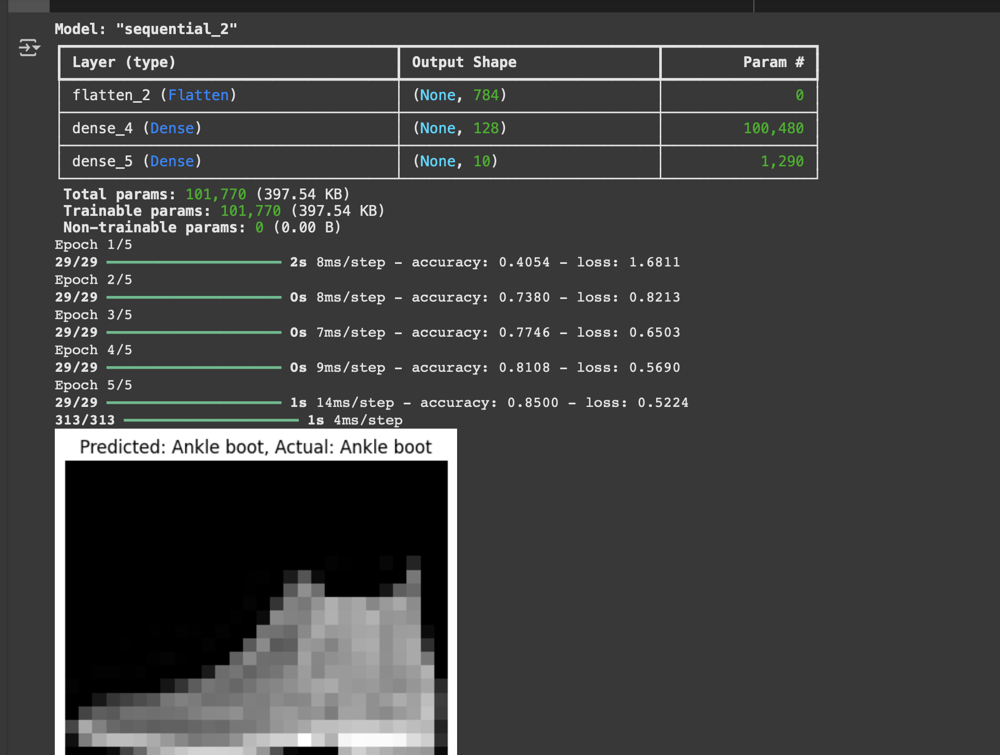

# Fashion Image Classifier

This is a simple project where I trained a model to recognise different types of clothing, like T-shirts, coats, and trainers, using TensorFlow.

It uses a small neural network trained on a subset of the Fashion MNIST dataset. The model achieved over 80% accuracy after just 5 training rounds.

## What it does
- Loads and processes 28x28 grayscale images of clothing
- Trains on 900 examples
- Predicts the clothing category for new images
- Displays predictions alongside the actual labels

## Categories
- T-shirt/top
- Trouser
- Pullover
- Dress
- Coat
- Sandal
- Shirt
- Trainer
- Bag
- Ankle boot

## Example output

## Why I built it
I built this as a quick intro to image classification, ahead of taking a computer vision module at university. It's also my first independent  machine learning project.
